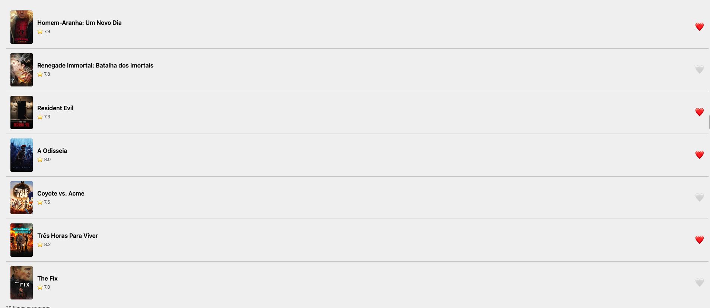
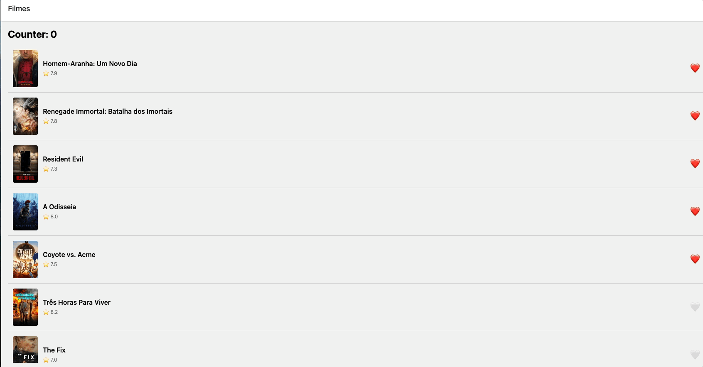

# Atividade 2 — App de Feed: Favoritos + MMKV + Reanimated

## Identificação

- **Aluno:** gabezy
- **Opção Reanimated escolhida:** **A — Heart pop** + **B — Card swipe** (bônus: 2 das 3 opções)
- **Disciplina:** Arquitetura de Aplicações Móveis e Multiplataforma — PUC IEC 2026

## Como rodar

```bash
cd exercicios/02-app-rn-navegacao-estado/aluno-gabezy
npm install
cp .env.example .env   # preencher com token da TMDB
npx expo start
```

No terminal do Expo: `i` (simulador iOS) ou `a` (emulador Android).

> ⚠️ MMKV não roda em web. Em web o app usa fallback para `localStorage` (`src/storage/mmkv.ts`), mas prefira simulador iOS/Android — Reanimated também tem limitações em web.

Testes:

```bash
npm test
```

## O que o app faz

Lista filmes populares da TMDB (TanStack Query) com navegação Stack para tela de detalhe. Cada card tem botão ❤️ que favorita/desfavorita o filme via store Zustand (`useFavoritesStore`). Os favoritos são persistidos com MMKV e sobrevivem a reloads do app. Ao tocar no ❤️, uma animação Reanimated de escala com spring roda direto na UI thread. Também dá para arrastar o card para a direita (favoritar) ou para a esquerda (descartar da lista).

## Screenshot

`MovieList` com ❤️ ativo:

<!-- TODO: adicionar screenshot -->


## Screencast da animação

Animação Reanimated (heart pop) funcionando — 15-30s:

<!-- TODO: adicionar screencast/GIF -->


## Arquitetura

```
src/
├── routes/
│   └── RootStack.tsx          ← Native Stack (Home → Detail)
├── screens/
│   ├── MovieList.tsx
│   └── MovieDetail.tsx
├── components/
│   ├── MovieCard.tsx
│   ├── HeartButton.tsx        ← animação Reanimated (heart pop)
│   └── SwipeableRow.tsx       ← animação Reanimated + Gesture Handler (card swipe)
├── store/
│   ├── counterStore.ts
│   └── favoritesStore.ts      ← Zustand + persistência MMKV via subscribe
├── storage/
│   └── mmkv.ts                ← MMKV (nativo) / localStorage (web)
├── queries/movies/            ← TanStack Query
└── services/api.ts            ← axios

__tests__/
├── counterStore.test.ts
└── favoritesStore.test.ts
```

## Decisões técnicas

- **Zustand `useFavoritesStore`:** guarda `ids: number[]` com `add`, `remove`, `toggle`, `clear` e o seletor derivado `isFavorite`.
- **Persistência:** feita manualmente — o estado inicial é lido do MMKV (`loadInitial`) e `useFavoritesStore.subscribe` grava os `ids` a cada mudança. Como o MMKV é síncrono (JSI, sem bridge), a leitura acontece na criação do store, sem hidratação assíncrona nem flicker.
- **MMKV em vez de AsyncStorage:** é ~30x mais rápido e síncrono, o que simplifica a hidratação do store.
- **Reanimated — opção A:** `useSharedValue` + `useAnimatedStyle` + `withSequence(withSpring(1.4), withSpring(1))` na escala + rotação leve (`-15° → 15° → 0°` com `withTiming`/`withSpring`). A animação roda na UI thread sem passar pela JS thread. Escolhi essa opção pelo melhor custo/benefício: é feedback visual direto da ação de favoritar.
- **Reanimated — opção B:** `Gesture.Pan()` + `GestureDetector` (react-native-gesture-handler) movem o card com `translateX`, e o card inclina conforme é arrastado (`interpolate`). Passando 30% da largura da tela: para a direita favorita e o card volta com `withSpring`; para a esquerda o card sai com `withTiming` e o filme é removido da lista (só na sessão atual). Callbacks JS são chamados com `runOnJS`. Usei a API `Gesture` em vez de `useAnimatedGestureHandler` porque esta foi descontinuada no Reanimated 3.

## Referência

- [React Native Reanimated — documentação oficial](https://docs.swmansion.com/react-native-reanimated/)
- [react-native-mmkv](https://github.com/mrousavy/react-native-mmkv)
- [Zustand](https://github.com/pmndrs/zustand)
